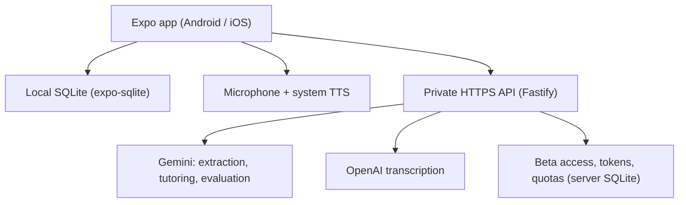

# ARCHITECTURE.md — components, flows and responsibilities

Source: `docs/BUILD_PLAN.md` sections 4, 5, 7, 9 and 10. Restated in English
for code agents. When in doubt, the plan wins.

## Overview



Post-session evaluation is a function of the same API and can use the same
Gemini model. It is not a separate service.

**Local-first, not offline.** Lessons and past exchanges are readable offline.
Extraction, transcription and new AI turns need a connection. The server
receives the context it needs during a request but stores no learning history.

## Components

| Part | Choice | Role |
| --- | --- | --- |
| Mobile | Expo, React Native, TypeScript strict, Expo Router | Android/iOS screens |
| Mobile persistence | `expo-sqlite` with versioned SQL migrations | Lessons, messages, events, progress |
| Capture | `expo-image-picker`, `expo-image-manipulator` | Camera/gallery, orientation, compression |
| Audio | `expo-audio` | Recording and playback |
| Voice V1 | `expo-speech` | Local TTS with system voices |
| Mobile secrets | `expo-secure-store` | Per-tester access token only, never provider keys |
| API | Node.js LTS, TypeScript, Fastify | Validation, providers, limits |
| Contracts | Zod in `packages/contracts/` | Input/output validation shared by app and API |
| Server data | SQLite on a persistent volume, one instance | Invitations, token hashes, quotas; no learning history |
| Tests | Vitest + device checks | Memory, API, recovery, audio |
| Builds | EAS Build | Installable apps |
| Distribution | Android APK, iOS TestFlight | Friends' beta |

Native modules are installed with `npx expo install` to match the SDK. Check
APIs in the documentation of the installed SDK version. Do not copy old
`expo-av` examples.

## Repository layout

| Path | Content |
| --- | --- |
| `apps/mobile/` | Expo app |
| `apps/api/` | API and AI adapters |
| `packages/contracts/` | Shared schemas and types, no secrets |
| `docs/PRODUCT.md` | Scope and journey |
| `docs/ARCHITECTURE.md` | This file |
| `docs/DATA_MODEL.md` | Tables, migrations, status computation |
| `docs/STATUS.md` | Done, verified, limitations, next step |
| `docs/DECISIONS.md` | Important decisions and reasons |
| `docs/TESTING.md` | Automated tests and device procedure (milestone 8) |
| `docs/RELEASE.md` | Installation and beta publication (milestone 9) |
| `docs/evals/` | Synthetic samples and anonymized results (milestone 8) |
| `AGENTS.md` | Common instructions for code agents |

npm workspaces, one lockfile. No Nx/Turborepo, Redis, Kubernetes, vector DB or
LangGraph in V1.

## AI providers

| Function | Starting choice | When to change |
| --- | --- | --- |
| Extraction | Gemini Flash with vision | Too many errors on real notes |
| Conversation | Same Gemini Flash model | Latency, cost, replies too hard |
| Evaluation | Same Gemini model, separate call at session end | Measured cost or weak evaluation |
| Transcription | OpenAI, configurable model (`gpt-transcribe` family as documented candidate) | Accent errors, English/target mixing |
| Voice | System voices via Expo Speech | Missing or unpleasant voice for a language |

Server configuration: `VISION_MODEL`, `TUTOR_MODEL`, `EVALUATOR_MODEL`,
`STT_MODEL` plus their providers, validated at startup. The first three may be
identical. **The exact Gemini model ID is chosen at implementation time** from
the models available in Tim's Google AI Studio project (stable, image input,
structured output). Never hard-code a model name in many files. Model names and
prices in the plan are not a benchmark.

Server SDKs: `@google/genai` with `GEMINI_API_KEY`; OpenAI SDK with
`OPENAI_API_KEY`. Request structured JSON matching a Gemini-supported schema,
then validate with Zod and business rules. Schema-valid output does not prove
the extraction or evaluation is correct.

Four TypeScript interfaces, one real implementation and one development mock
each:

```ts
extractLesson(input): Promise<LessonDraft>
generateTutorTurn(input): Promise<TutorTurn>
evaluateSession(input): Promise<SessionEvaluation>
transcribeAudio(input): Promise<Transcript>
```

Mock mode is explicit (`PROVIDER_MODE=mock` or equivalent). A production build
never silently falls back to mocks.

No second LLM per turn in V1. The tutor may return one short correction; the
structured analysis for memory happens once at session end. Per-turn parallel
evaluation only if an observed need justifies it.

An STT may silently correct a sentence or guess a word from hints. A clean
transcript proves neither pronunciation nor grammar mastery. Test without
hints too. Never display a pronunciation score computed from a transcript.

## API routes and contracts

| Route | Input | Output |
| --- | --- | --- |
| `GET /health` | Nothing | Service status, no secret configuration |
| `POST /v1/access/redeem` | Individual beta code | Opaque revocable token |
| `POST /v1/lessons/extract` | Photo + language | Lesson draft, items, uncertainties |
| `POST /v1/audio/transcribe` | Audio + language + bounded hints | Raw transcript and available metadata |
| `POST /v1/tutor/turn` | Session, snapshot, context, versioned message | Reply, optional reading, English meaning, optional correction |
| `POST /v1/sessions/evaluate` | Snapshot + bounded exchanges | Observations with references + proposed summary |

All paid routes require the access token. The server validates size, format
and language, then builds the system prompts itself. The client cannot choose
a provider URL or an arbitrary model.

Example observation returned by evaluation:

```json
{
  "message_id": "message-uuid",
  "message_revision": 1,
  "item_id": "item-uuid",
  "event_kind": "use",
  "verdict": "correct",
  "evidence_text": "내일 친구와 같이 가요",
  "assisted": false,
  "note_en": "Used 같이 appropriately in this sentence."
}
```

`assisted` is checked against app metadata. The API verifies IDs and that the
evidence appears in the message; this does not by itself prove linguistic
correctness.

### Limits and errors (V1 defaults, enforced server-side too)

- Image ≤ 5 MB after compression; audio ≤ 60 s and ≤ 10 MB; bounded message
  count per request.
- Explicit timeouts, cancellation, structured errors
  `{ code, message, retryable, request_id }`.
- Invalid model JSON: at most one bounded repair attempt, then a recoverable
  error.
- Stable `request_id` with a very short in-memory response cache on this
  single-instance API to avoid double generations. After a restart a request
  may cost again; mobile idempotence still prevents duplicate progress.
  Exactly-once billing is not promised.

## Tutor context budget

Priority order: system rules → target language → lesson snapshot → recent
exchanges → session summary → relevant memory. Initial budget: 10 active words,
2 patterns, last 8 messages, summary ≤ 150 words, 5 memory observations. Always
keep the last question and the user's answer. The full transcript stays local
and is not resent every turn. No embeddings.

## Access, privacy and cost

- Provider keys only in the API's private environment. `EXPO_PUBLIC_*` is
  public. A shared secret embedded in every APK is not access control.
- Beta access: individual random, one-use, expiring codes. Redeeming creates a
  revocable token stored in SecureStore. The server stores only hashes of codes
  and tokens. Rate-limit code attempts; per-tester quotas.
- Initial quotas: 3 extractions and 100 turns per day per tester, configurable.
  A global application spending cap with conservative cost reservation before
  a call and accounting after. When exceeded, paid calls are refused and local
  reading still works.
- Logging: no photos, audio, raw text or tokens. Only technical status,
  duration, model, billable usage, request ID. Temporary files deleted after
  success/failure and at startup.
- Photos and audio are temporary on the app side. Keep validated lessons and
  transcripts, not recordings, by default.
- Notes are untrusted data: an instruction written inside a photo is extracted
  as content at most, never applied as a system rule. The app needs no tools
  that could execute such instructions.
- Versioned JSON backup export/import (lessons, messages, progress; no keys or
  tokens). Replacement import only in V1, after backup and confirmation, with
  schema/reference/limit validation, transactional import and aggregate
  rebuild. Local deletion also cancels pending jobs.
- Pilot budget: 20–30 € set aside for first API trials (a chosen envelope, not
  a quote). Measure the real cost of a session before inviting more people.

## Hosting and distribution (milestone 9)

- API: Docker image, Node hosting with HTTPS, secrets and a persistent volume.
  **One instance** while quotas live in SQLite. No ephemeral disk.
- Local development: a phone cannot reach the PC through `localhost`; use the
  LAN address of the dev machine or an HTTPS tunnel. Never disable TLS checks.
- Beta: the app points to the hosted API; neither Tim's PC nor Metro must stay
  on.
- Android: Expo Go early, development build for native testing, signed
  standalone APK for friends. iOS: TestFlight for friends (not ad hoc
  distribution). Builds through EAS Build from Windows; iOS local builds and
  simulator need macOS. Apple Developer Program is 99 USD/year as announced.
- Download page comes after a working beta: static page, Android APK button,
  iOS TestFlight button, short data notice, feedback link. No accounts, no
  separate web backend.
