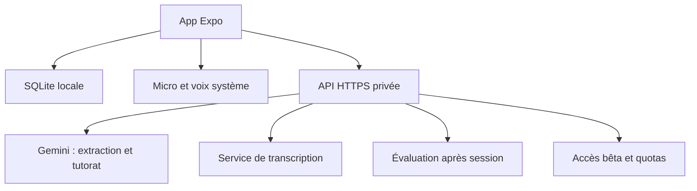

# Speak My Notes — plan de création et prompts

Version de travail du 15 septembre 2026 — Gemini pour la vision, le tutorat et les bilans. Pour Tim : une application personnelle, puis une petite bêta avec des amis. Explications en français ; prompts de développement, code et interface en anglais.

## 1. La décision de départ

Construire une application **React Native avec Expo et TypeScript**, commune à Android et iOS, avec une base SQLite sur le téléphone et une petite API qui protège les clés des fournisseurs d’IA.

La promesse : **Turn today's lesson into a conversation.** Photographier ses notes, vérifier la leçon extraite, puis pratiquer pendant quelques minutes. L’application conserve les éléments travaillés et adapte les prochaines sessions.

Je simplifierais l’architecture proposée dans le texte joint : garder des fonctions séparées pour extraction, tutorat, transcription et évaluation, mais commencer avec **un fournisseur de texte/vision et un fournisseur de transcription**. Pas besoin de plusieurs agents autonomes ni d’un framework d’orchestration. On pourra changer un modèle si les essais montrent un problème précis.

**Premier résultat attendu :** sur un vrai téléphone, importer une photo, corriger les mots extraits, faire cinq échanges vocaux, fermer complètement l’app, la rouvrir et retrouver sa leçon et sa progression.

## 2. Périmètre de la première version

| Inclus dans la bêta | Plus tard, seulement si utile |
| --- | --- |
| Android et iOS avec le même code | Application de bureau ou version web complète |
| Chinois mandarin, coréen, français | Autres langues et interface multilingue |
| Interface et explications en anglais | Traduction de toute l’interface |
| Une photo par leçon, caméra ou galerie | PDF, lots de photos et reconnaissance de cahiers entiers |
| Extraction modifiable de vocabulaire et grammaire | Import automatique sans vérification |
| Conversation liée à la leçon | Cursus complet, exercices et flashcards |
| Bouton pour commencer et terminer l’enregistrement | Conversation audio continue et détection automatique des tours |
| Réponse écrite et prononcée, aide et répétition | Avatars, voix personnalisées et animations complexes |
| Historique local et mémoire par langue | Compte, synchronisation et dashboard avancé |
| Accès bêta par code individuel | Abonnements et paiements |

Une saisie de texte manuelle de la leçon et des messages sert aussi de solution de secours. Elle ne doit pas devenir un second produit.

## 3. Parcours et écrans

1. **Welcome.** Choisir Chinese, Korean ou French. L’anglais est fixé comme langue d’aide. Pas de questionnaire CEFR. Une mention simple explique que photos et enregistrements sont envoyés à des services IA pour traitement, et que l’historique est conservé sur cet appareil.
2. **My lessons.** Liste des leçons dans la langue sélectionnée, bouton Add notes et accès aux sessions précédentes. Changer de langue ne supprime rien.
3. **Add notes.** Prendre une photo ou en sélectionner une. Prévisualiser, remplacer ou lancer Extract lesson. Une solution de saisie manuelle reste disponible.
4. **Review lesson.** Modifier le terme, la lecture et le sens anglais ; supprimer les éléments douteux ; corriger la grammaire. Signaler les zones illisibles. Sélectionner au maximum dix mots et deux structures pour la session, sans supprimer les autres de la leçon.
5. **Practice.** Situation courte proposée à partir des notes, messages, bouton Record/Stop, texte transcrit modifiable avant envoi, réponse audio, Repeat, Show meaning, Help me answer et End session. Une seule correction prioritaire à la fois, non bloquante.
6. **Session recap.** Durée active, éléments pratiqués, deux ou trois observations étayées et bouton Practice again. Pas de niveau inventé.
7. **Settings.** Langue, affichage des lectures, test de voix, code bêta, export/import de sauvegarde et suppression des données.

Pour le chinois, afficher les caractères et le pinyin. Préserver l’écriture de la photo : ne pas convertir silencieusement traditionnel et simplifié. Pour le coréen, privilégier le hangul avec romanisation masquable. Pour le français, `reading = null` ; pas d’IPA en V1.

| Langue | Code interne | Locale vocale initiale | Sens et explications |
| --- | --- | --- | --- |
| Mandarin | `zh` | `zh-CN` | Anglais |
| Coréen | `ko` | `ko-KR` | Anglais |
| Français | `fr` | `fr-FR` | Anglais |

Ces locales sont des choix de départ ; la disponibilité réelle des voix se vérifie sur les téléphones.

## 4. Architecture retenue



`Évaluation après session` est une fonction de la même API et peut utiliser le même modèle Gemini. Ce n’est pas un service supplémentaire à déployer.

| Partie | Choix | Rôle |
| --- | --- | --- |
| Mobile | Expo, React Native, TypeScript, Expo Router | Écrans Android/iOS |
| Persistance mobile | `expo-sqlite`, migrations SQL | Leçons, messages, événements et progression |
| Capture | `expo-image-picker`, `expo-image-manipulator` | Caméra/galerie, orientation et compression |
| Audio | `expo-audio` | Enregistrement et lecture des fichiers |
| Voix V1 | `expo-speech` | Synthèse locale via les voix du système |
| Secrets d’accès mobile | `expo-secure-store` | Jeton propre au testeur, jamais les clés IA |
| API | Node.js LTS, TypeScript, Fastify | Validation, fournisseurs et limites |
| Contrats | Zod dans un package partagé | Validation d’entrée et de sortie |
| Données serveur | SQLite sur volume persistant, une instance | Invitations, jetons, quotas ; aucun historique pédagogique |
| Tests ciblés | Vitest et essais sur appareils | Mémoire, API, reprise et audio |
| Builds | EAS Build | Applications installables |
| Distribution | APK Android et TestFlight iOS | Test par les amis |

Les bibliothèques natives sont installées avec `npx expo install` pour respecter le SDK choisi. Vérifier les API dans la documentation du SDK réellement installé : ne pas copier des exemples anciens de `expo-av`. Expo documente l’enregistrement dans [expo-audio](https://docs.expo.dev/versions/latest/sdk/audio/), la synthèse dans [expo-speech](https://docs.expo.dev/versions/latest/sdk/speech/) et la persistance dans [expo-sqlite](https://docs.expo.dev/versions/latest/sdk/sqlite/).

**Local-first ne signifie pas sans Internet.** Les leçons et anciens échanges restent consultables hors ligne. Extraction, transcription et nouveaux échanges IA demandent une connexion. Le serveur reçoit le contexte nécessaire pendant les requêtes, même s’il ne conserve pas la base d’apprentissage.

### Organisation du dépôt

| Chemin | Contenu |
| --- | --- |
| `apps/mobile/` | Application Expo |
| `apps/api/` | API et adaptateurs IA |
| `packages/contracts/` | Schémas et types partagés, sans secrets |
| `docs/PRODUCT.md` | Périmètre et parcours |
| `docs/ARCHITECTURE.md` | Flux, responsabilités et choix |
| `docs/DATA_MODEL.md` | Tables, migrations et calcul des statuts |
| `docs/STATUS.md` | Réalisé, vérifié, limites et prochaine étape |
| `docs/DECISIONS.md` | Décisions importantes et raison |
| `docs/TESTING.md` | Tests automatisés et procédure appareils |
| `docs/RELEASE.md` | Installation et publication bêta |
| `docs/evals/` | Exemples synthétiques et résultats anonymisés |
| `AGENTS.md` | Instructions communes pour les agents de code |

Utiliser npm workspaces et un seul lockfile. Un monorepo modeste suffit ; pas de Nx/Turborepo, Redis, Kubernetes, base vectorielle ou LangGraph pour cette V1.

## 5. Choix des IA

| Fonction | Départ proposé | Quand changer |
| --- | --- | --- |
| Extraction | Gemini Flash, modèle avec vision | Trop d’erreurs sur les vraies notes |
| Conversation | Le même modèle Gemini Flash au départ | Latence, coût ou réponses trop difficiles |
| Bilan et observations | Le même modèle Gemini, appel distinct en fin de session | Coût mesuré ou évaluation insuffisante |
| Transcription | OpenAI, modèle configurable ; `gpt-transcribe` comme candidat documenté | Erreurs sur accents, mélange anglais/langue cible |
| Voix | Voix système via Expo Speech | Voix absente ou jugée désagréable sur une langue |

La [documentation Gemini](https://ai.google.dev/gemini-api/docs/models) sert à choisir un identifiant accessible lors de l’implémentation. La [documentation de transcription OpenAI](https://developers.openai.com/api/docs/guides/speech-to-text) décrit la transcription de fichiers et les indications de langue/vocabulaire. L’adaptateur doit vérifier les paramètres propres au modèle ; ne pas supposer que tous ont les mêmes champs.

**Les noms et tarifs du document initial ne constituent pas un benchmark.** Ne pas graver un modèle dans vingt fichiers. Garder côté serveur `VISION_MODEL`, `TUTOR_MODEL`, `EVALUATOR_MODEL` et `STT_MODEL`, avec les fournisseurs associés et un contrôle de configuration. Les trois premiers peuvent être identiques.

**Choix de départ : Gemini Flash pour les trois fonctions texte/vision.** Choisir un modèle stable disponible dans ton projet Google AI Studio, compatible avec images et sorties structurées. Vérifier son identifiant exact lors de l’implémentation et configurer les trois variables avec cet identifiant. Ce choix suit ta préférence de simplicité et de coût ; le coût réel reste à mesurer sur tes sessions, sans affirmer que toute variante Gemini est moins chère que toute variante Claude.

Utiliser le SDK JavaScript/TypeScript officiel `@google/genai` côté serveur, avec `GEMINI_API_KEY` comme variable privée de configuration. Demander un JSON structuré conforme au schéma pris en charge par Gemini, puis le valider avec Zod et les règles métier. Une sortie conforme au schéma ne garantit pas la justesse de l’extraction ou de l’évaluation. Voir la [compréhension d’images](https://ai.google.dev/gemini-api/docs/image-understanding) et les [sorties structurées Gemini](https://ai.google.dev/gemini-api/docs/structured-output).

La transcription reste chez OpenAI dans cette version du plan et la voix utilise Expo Speech. Aucun adaptateur Anthropic n’est nécessaire pour faire fonctionner l’application. Claude et Codex peuvent toujours servir à écrire et relire le code.

Interfaces TypeScript simples : `extractLesson`, `generateTutorTurn`, `evaluateSession`, `transcribeAudio`. Une implémentation réelle par fonction, plus des mocks de développement. Aucun routage dynamique entre dix fournisseurs.

L’évaluation hors du chemin critique est utile, mais **lancer un second LLM à chaque tour n’est pas nécessaire au départ**. Le tutorat renvoie éventuellement une courte correction ; l’analyse structurée pour la mémoire intervient à la fin. On ne passe à une évaluation parallèle par tour que si un besoin observé le justifie.

Attention : un STT peut corriger implicitement une phrase ou deviner un mot grâce aux indices. Un texte bien transcrit ne prouve ni une bonne prononciation ni une maîtrise grammaticale. Tester aussi sans indices, et ne jamais afficher un score de prononciation à partir du seul transcript.

## 6. Données et mémoire : prévoir la fiabilité dès le début

L’historique reste sur le téléphone. Un `profile_id` UUID représente l’apprenant local ; ce n’est pas un compte distant. Toutes les données pédagogiques sont isolées par profil et langue.

### Tables proposées

| Table | Champs essentiels |
| --- | --- |
| `profiles` | `id`, `support_language='en'`, `selected_language`, `created_at` |
| `lessons` | `id`, `profile_id`, `language`, `title`, `status`, `created_at`, `updated_at` |
| `learning_items` | `id`, `profile_id`, `language`, `kind`, `canonical_form`, `reading`, `meaning_en`, `explanation_en`, `sense_key` |
| `lesson_items` | `lesson_id`, `item_id`, `source_text`, `source_kind`, `review_status`, `position` |
| `sessions` | `id`, `profile_id`, `lesson_id`, `language`, `lesson_snapshot_json`, `status`, `started_at`, `ended_at`, `active_seconds`, `evaluation_status` |
| `messages` | `id`, `session_id`, `role`, `sequence`, `content`, `raw_transcript`, `input_source`, `revision`, `created_at` |
| `learning_events` | `id`, `session_id`, `message_id`, `message_revision`, `item_id`, `event_kind`, `verdict`, `assisted`, `evidence_text`, `evaluator_version`, `valid` |
| `item_progress` | `profile_id`, `item_id`, `times_seen`, `times_used`, `correct_uses`, `incorrect_uses`, `last_seen_at`, `last_error`, `status` |
| `language_progress` | `profile_id`, `language`, `sessions_count`, `total_practice_seconds`, `learner_summary`, `summary_version`, `updated_at` |
| `pending_jobs` | `id`, `session_id`, `job_kind`, `payload_version`, `status`, `attempts`, `last_error` |

Une table commune `learning_items` avec `kind='vocabulary'|'grammar'` évite de dupliquer toutes les opérations. `reading` est nullable. La grammaire utilise `canonical_form` comme pattern et `explanation_en` pour l’explication.

Les UUID sont créés par le code. Les modèles référencent les identifiants connus ; ils ne créent ni profils ni clés de base.

### Identité des mots

Ne pas identifier un mot par sa seule chaîne brute. Utiliser la langue, la forme canonique, le type et un sens distinct. Normalisation Unicode NFC et espaces ; ne pas effacer accents, tons ou différences d’écriture. Les variantes fléchies coréennes/françaises sont reliées à un élément sur preuve, sans fusion automatique incertaine. Un même mot dans deux leçons doit réutiliser sa progression lorsque le sens est identique.

Une fusion douteuse reste une proposition dans Review lesson. Ne pas imposer un algorithme de lemmatisation universel en V1.

### Ce qui est mesuré et ce qui est estimé

- Une session terminée, une durée active et un message envoyé sont des événements observables.
- `times_seen` signifie « affiché dans un message du tuteur », au plus une fois par élément et message ; cela ne signifie pas « compris ». Une relecture audio ne l’incrémente pas.
- `times_used` signifie « usage relevé dans un message de l’utilisateur », au plus une fois par élément et message. Pour les formes fléchies ou la grammaire, cette détection peut dépendre d’une estimation du modèle.
- `correct_uses` et `incorrect_uses` reposent sur une évaluation, pas sur une vérité objective. Conserver la citation exacte, la version du message et l’évaluateur. Autoriser `uncertain`.
- Les réponses copiées depuis Help me answer ou tapées après transcription sont étiquetées séparément. Elles ne prouvent pas un rappel oral spontané.

**Les compteurs sont recalculables à partir des événements.** Le modèle propose des observations ; le code vérifie les références et agrège. Il ne doit jamais accepter un JSON qui dit simplement « mets comfortable ».

### Règle de statut initiale, volontairement prudente

`new` : aucun usage de l’apprenant. `learning` : au moins un usage. `comfortable` : au moins cinq usages jugés corrects sans aide, répartis sur trois sessions, et aucun verdict incorrect parmi les trois dernières tentatives évaluables. Une nouvelle erreur remet en `learning`.

Ce sont des heuristiques produit à ajuster, pas une échelle scientifique ou CEFR. Ne pas mélanger performances tapées et orales pour attribuer `comfortable` en pratique orale. Une transcription modifiée peut être conservée comme pratique textuelle, mais ne compte pas vers ce seuil oral.

Pour les difficultés récurrentes, sélectionner des observations répétées et sourcées ; pas besoin d’un quatrième statut `struggling`. Pour un élément grammatical, `times_seen` peut rester indéterminé si on n’a pas de preuve fiable.

### Reprises et idempotence

Une contrainte unique sur `(session_id, message_id, message_revision, item_id, event_kind)` empêche le double comptage lors d’une nouvelle tentative. Réinsérer la même évaluation ne change pas la progression. Modifier une transcription invalide les observations associées à l’ancienne révision. Un nouvel évaluateur ne doit pas doubler les anciens événements : remplacement transactionnel ou révision explicite.

Une session conserve un snapshot de sa leçon : modifier celle-ci ensuite ne change pas les preuves du passé. Les durées excluent le temps en arrière-plan. Une finalisation répétée n’incrémente pas `sessions_count` deux fois.

### Contexte envoyé au tuteur

Priorité : règles système → langue cible → snapshot de la leçon → derniers échanges → résumé de session → mémoire pertinente. Budget initial indicatif : dix mots actifs, deux structures, huit derniers messages, résumé de 150 mots maximum et cinq observations de mémoire. Toujours préserver la dernière question et la réponse utilisateur.

Le transcript complet reste local ; il n’est pas nécessaire de le renvoyer en entier à chaque tour. Pour une nouvelle session, sélectionner les observations des éléments actifs et quelques difficultés pertinentes de la même langue. Pas d’embeddings nécessaires.

Les mots de la leçon sont prioritaires, mais les mots fonctionnels et le vocabulaire nécessaire à une phrase naturelle restent autorisés. Un « vocabulaire exclusivement limité aux dix mots » rendrait souvent la conversation impossible. Ne pas forcer d’anciens mots ; tout ajout utile doit rester limité.

## 7. API et contrats

| Route | Entrée | Sortie |
| --- | --- | --- |
| `GET /health` | Rien | État du service, aucune configuration secrète |
| `POST /v1/access/redeem` | Code bêta individuel | Jeton opaque révocable |
| `POST /v1/lessons/extract` | Photo et langue | Brouillon de leçon, éléments et incertitudes |
| `POST /v1/audio/transcribe` | Audio, langue et indices limités | Transcript brut et métadonnées disponibles |
| `POST /v1/tutor/turn` | Session, snapshot, contexte et message versionné | Réponse, lecture facultative, sens anglais et correction facultative |
| `POST /v1/sessions/evaluate` | Snapshot et échanges bornés | Observations avec références et résumé proposé |

Toutes les routes payantes exigent le jeton d’accès. Le serveur valide taille, format et langue, puis construit lui-même les messages système. Le client ne peut choisir ni une URL de fournisseur ni un modèle arbitraire.

Exemple d’observation attendue :

```json
{
  "message_id": "message-uuid",
  "message_revision": 1,
  "item_id": "item-uuid",
  "event_kind": "use",
  "verdict": "correct",
  "evidence_text": "내일 친구와 같이 가요",
  "assisted": false,
  "note_en": "Used 같이 appropriately in this sentence."
}
```

`assisted` est vérifié contre les métadonnées de l’app. L’API contrôle les identifiants et la présence de l’extrait dans le message ; cette validation ne démontre pas à elle seule la justesse linguistique.

Limiter par défaut une image à 5 Mo après compression, un audio à 60 secondes et 10 Mo, et le nombre de messages transmis. Ces limites sont des choix V1 et doivent aussi être vérifiées au serveur. Prévoir un timeout explicite, annulation et erreurs structurées (`code`, `message`, `retryable`, `request_id`). Une sortie JSON invalide donne au plus une réparation bornée, puis une erreur récupérable.

Pour éviter les doubles générations, utiliser un `request_id` stable et un cache de réponse très court en mémoire sur cette API mono-instance. Après redémarrage, une requête peut coûter à nouveau ; l’idempotence mobile empêche néanmoins les doublons de progression. Ne pas promettre une facturation exactement une fois.

## 8. Boucle audio

1. L’utilisateur appuie sur Record. Toute synthèse en cours s’arrête.
2. Il parle et appuie sur Stop ; limite douce avec compteur visible, arrêt à 60 secondes.
3. L’app envoie le fichier au backend et montre Transcribing.
4. Le transcript s’affiche avec Send, Edit et Try again. En V1, la confirmation explicite évite de traiter une mauvaise transcription comme une faute.
5. Après Send, le tuteur renvoie une ou deux phrases et une question courte ; l’app affiche le texte et le lit.
6. Une correction facultative apparaît sous le message. La synthèse ne lit que la langue cible, pas les métadonnées ni l’explication anglaise.
7. En fin de session, le bilan est demandé et appliqué transactionnellement à la mémoire.

Gérer explicitement `idle`, `recording`, `transcribing`, `reviewing`, `thinking`, `speaking`, `error`. Un seul tour soumis à la fois. Une réponse tardive ne doit pas se rattacher à une autre session. La mise en arrière-plan interrompt proprement l’enregistrement et la voix.

Le bilan passe dans `pending_jobs` avant l’appel. Si l’app est fermée, reprendre au prochain lancement au premier plan ; ne pas compter sur une tâche JavaScript qui continuerait après fermeture. L’écran peut indiquer Analysis pending et afficher immédiatement la durée et les échanges locaux.

Tester micro refusé, silence, réseau coupé, écran verrouillé, appels audio concurrents, écouteurs et voix manquante. Expo signale que la synthèse via `expo-speech` peut rester muette sur un iPhone physique en mode silencieux : prévoir un bouton Test voice et une aide contextualisée. [Documentation Expo Speech](https://docs.expo.dev/versions/latest/sdk/speech/)

## 9. Accès, confidentialité et coût

Les clés Gemini/OpenAI sont exclusivement dans les variables privées du backend. Toute variable `EXPO_PUBLIC_*` est considérée publique. Un secret identique intégré à tous les APK n’est pas un contrôle d’accès.

Pour dix amis : générer des codes individuels aléatoires, à usage unique et expirables. Leur échange crée un jeton révocable stocké dans SecureStore ; le serveur ne conserve que des empreintes des codes/jetons. Appliquer une limite aux tentatives de code et des quotas par testeur. Les UUID de profil ne sont pas des secrets.

Suggestion initiale : trois extractions et cent tours par jour et par testeur, configurable. Ajouter un plafond global de dépenses applicatif, avec réservation prudente du coût avant appel et comptabilisation après retour. En cas de dépassement, refuser les appels payants et laisser la consultation locale fonctionner. Les alertes d’un fournisseur ne sont pas nécessairement un arrêt automatique de dépenses.

Le serveur ne journalise ni photos, ni audio, ni texte brut, ni jetons. Il conserve uniquement statut technique, durée, modèle, usage facturable et identifiant de requête. Effacer les fichiers temporaires après succès/échec et au démarrage pour les restes de crash. Photos et audio sont temporaires côté app ; conserver les leçons validées et transcriptions, pas les enregistrements par défaut. Les politiques de conservation des fournisseurs restent distinctes : ne pas promettre « rien ne quitte votre téléphone ».

Les notes sont des données non fiables : une instruction écrite dans une photo doit être extraite comme contenu éventuel, jamais remplacer les règles système. L’app n’a pas besoin d’outils capables d’exécuter ces instructions.

Avant la bêta, un export/import JSON versionné sauvegarde leçons, messages et progression, sans clés ni jetons. Import de remplacement uniquement en V1, après sauvegarde et confirmation ; pas de fusion entre bases. Vérifier schéma, références et limites avant mutation, puis importer en transaction et reconstruire les agrégats. Une suppression locale annule aussi les jobs en attente. Sans export ou synchronisation, désinstallation/changement de téléphone peut perdre les données.

**Budget de pilotage proposé :** mettre de côté 20–30 € pour les premiers essais API ; c’est une enveloppe choisie, pas un devis. Mesurer le coût d’une session réelle avant de multiplier les invitations. La formule est : extraction amortie + minutes audio utilisateur × tarif STT + tokens du tutorat + bilan + éventuelle voix payante. Ajouter séparément l’hébergement et les builds.

Ne pas lancer un grand benchmark avant la première boucle. Commencer avec neuf photos, trois par langue, et trois mini-sessions. Après validation, passer à vingt photos et une trentaine de tours difficiles. Comparer un second modèle seulement sur les points qui posent problème.

## 10. Installation Android, iOS et rôle du site

| Étape | Android | iPhone |
| --- | --- | --- |
| Début du développement | Expo Go si modules compatibles | Expo Go si SDK et modules compatibles |
| Tests natifs développeur | Development build | Development build signé |
| Bêta amis | APK signé autonome | TestFlight |
| Diffusion publique ultérieure | Google Play ou distribution directe selon règles applicables | App Store comme chemin standard |

Expo Go sert aux premiers essais. Une development build permet de tester le code natif propre à l’app ; ce n’est pas la build autonome à donner par défaut aux amis. [Expo : development builds](https://docs.expo.dev/develop/development-builds/introduction/) et [limitations d’Expo Go](https://docs.expo.dev/develop/development-builds/faq/)

Sur Android, EAS peut produire un APK installable depuis un lien web. Un AAB sert à la distribution Play Store. Sur iOS, la distribution ad hoc exige des appareils enregistrés ; elle devient contraignante pour inviter librement. [Expo : distribution interne](https://docs.expo.dev/build/internal-distribution/)

Pour les amis sur iPhone, utiliser TestFlight : invitation ou lien, installation de TestFlight, puis installation de l’app. Prévoir la revue de la première bêta externe et le renouvellement des builds, utilisables jusqu’à 90 jours. [Apple : TestFlight](https://developer.apple.com/help/app-store-connect/test-a-beta-version/testflight-overview)

Le programme Apple Developer est annoncé à **99 USD par an**, avec prix local au moment de l’inscription. [Apple : inscription](https://developer.apple.com/programs/enroll/)

Tu peux coder depuis Windows et utiliser le service de compilation EAS pour les builds ; la compilation iOS locale et le simulateur Apple demandent un environnement macOS/Xcode. Privilégier un vrai iPhone pour la validation audio. [Expo : EAS Build](https://docs.expo.dev/build/introduction/)

Le site viendra après la bêta fonctionnelle : une page avec capture, présentation, bouton Download for Android, bouton Join iOS beta, explication courte du traitement des données et lien de retour. Aucun compte ni backend web distinct nécessaire. Ne pas prévoir un téléchargement IPA public comme équivalent universel de l’APK.

### Hébergement de l’API

Préparer une image Docker et choisir un hébergement Node avec HTTPS, secrets et volume persistant. **Une seule instance** tant que les quotas sont en SQLite. Éviter un déploiement à disque éphémère qui remettrait les plafonds et invitations à zéro. Un changement vers plusieurs instances nécessitera une base partagée et des quotas atomiques.

En local, un téléphone ne joint pas l’ordinateur avec `localhost` : documenter l’adresse réseau de développement ou un tunnel HTTPS. En bêta, l’URL pointe vers le serveur hébergé ; ni le PC de Tim ni Metro ne doivent rester allumés. Ne jamais désactiver la vérification TLS pour faire marcher le test.

## 11. Roadmap et critères de passage

Estimations de travail concentré, aide au code comprise, sans garantie : environ **12–22 journées**, soit plutôt quatre à huit semaines à rythme personnel. Les comptes Apple, revues et problèmes audio peuvent ajouter du délai. Avancer par résultats observables.

| Lot | Travail | Terminé quand… | Estimation |
| --- | --- | --- | --- |
| 0 | Cadrage et état du dépôt | Documentation et exclusions cohérentes | 0,5 j |
| 1 | Expo, API et contrats | Démo simulée démarre et health répond | 1 j |
| 2 | Écrans, SQLite et données d’exemple | Leçon créée, éditée, retrouvée après relance | 1–2 j |
| 3 | Photo et vraie extraction | Une photo par langue donne une leçon corrigible | 1–2 j |
| 4 | Tutorat textuel réel | Cinq tours naturels liés aux notes | 1–2 j |
| 5 | Audio | Cinq tours vocaux sur Android et iPhone | 2–4 j |
| 6 | Mémoire et reprises | Bilan appliqué une seule fois et retrouvé | 2–3 j |
| 7 | Accès, quotas et sauvegardes | Bêta protégée, données restaurables | 1–2 j |
| 8 | Validation, serveur et builds | Deux amis installent sans environnement de dev | 2–3 j |
| 9 | Page de téléchargement | Les deux liens mènent à une installation réelle | 0,5–1 j |

Premier essai externe : deux amis seulement, idéalement un Android et un iPhone. Puis cinq à dix après correction. Mesurer : photo exploitable, temps jusqu’au premier échange, latence après Send, corrections injustifiées, coût et envie de refaire une session. Une conversation de dix minutes utile compte davantage qu’un beau dashboard.

## 12. Comment utiliser Claude et Codex

Les deux peuvent coder. Mon organisation proposée : **Codex implémente un lot ; Claude relit le diff et les choix délicats**. Inverser est possible. Un seul écrit dans la même branche à un instant donné.

Conserver ce document dans `docs/BUILD_PLAN.md`. Envoyer d’abord le prompt 0 avec le fichier complet, puis un seul prompt numéroté à la fois. À chaque nouvelle session, l’agent relit les documents et l’état Git. Les fichiers du dépôt servent de continuité ; ne pas dépendre de la mémoire du chat.

Une branche par lot, petit commit vérifiable, puis revue avant fusion. Ne pas ajouter de fonctionnalité parce que l’agent la suggère. Les humains gardent les tests sur téléphone et les décisions produit.

### Prompt 0 — consignes communes et cadrage

```text
You are building Speak My Notes, a small mobile app for me and a few friends.
Read the attached build plan completely. Save it as docs/BUILD_PLAN.md if it
is not already in the repository. Inspect the repository and git status first.
Preserve existing work; do not reinitialize or overwrite an existing app.

The product turns a photo of language-class notes into speaking practice.
Target languages: zh, ko, fr only. UI and support language: English.
Stack: Expo React Native TypeScript, local SQLite, a small TypeScript Fastify
backend, shared Zod contracts, npm workspaces. Provider keys stay server-side.
Use Gemini for image extraction, tutoring and post-session evaluation; one
verified stable Flash model initially, with separately configurable model IDs.
Use OpenAI for transcription and Expo Speech for TTS. Gemini is the app runtime
provider; Claude and Codex remain development/review tools.

Create PRODUCT.md, ARCHITECTURE.md, DATA_MODEL.md, DECISIONS.md, STATUS.md and
AGENTS.md from the plan. Keep the proposed scope small. Do not build the app
yet. Record a numbered backlog matching the implementation prompts.

For every later task: read these files, inspect existing code, implement only
the requested milestone, run relevant checks, and update STATUS.md. Distinguish
mock results, live API checks, and physical-device checks. Never claim device
validation without performing it. Never invent API names, model access or prices.
Use the installed SDK's official documentation. Keep secrets and private notes
out of git. No multi-agent framework, vector DB, payments, cloud learner sync,
or unrelated refactor. Ask only for genuinely blocking missing information.
Finish with changed behavior, checks performed, limitations and next milestone.
```

### Prompt 1 — fondation exécutable

```text
Read AGENTS.md and docs/BUILD_PLAN.md. Implement milestone 1 only.
Create or adapt npm workspaces: apps/mobile, apps/api, packages/contracts.
Use a current stable compatible Expo SDK, Expo Router and TypeScript strict.
Pin dependencies with one lockfile. Build a small Fastify API with /health,
configuration validation, structured errors and shared Zod language schemas.

Add explicit mock-provider mode so the full development environment starts
without paid API keys. Do not silently fall back to mocks in a production build.
Only the API base URL and nonsecret flags may use EXPO_PUBLIC variables.
Add .env.example placeholders, gitignore rules, lint/typecheck/test scripts,
and a basic CI workflow. Do not build release binaries or deploy yet.

Document exact Windows-friendly startup commands and how a physical phone
reaches the local API. Verify typechecking, API health and app bundling where
available. Update STATUS.md with checks that still require a phone.
```

### Prompt 2 — écrans et base locale

```text
Read the plan and current code. Implement milestone 2 using fixture data.
Build Welcome, My lessons, Add notes placeholder, Review lesson, Practice
placeholder, Recap and Settings. All UI strings must be English. Use a simple
consistent visual style, accessible controls, large text support and safe areas.

Implement versioned expo-sqlite migrations and repositories for the plan's
data model, with UUIDs, foreign keys, transactional writes and parameterized SQL.
Keep UI code separate from persistence. Seed one explicitly labeled demo lesson
per language. Support manual lesson creation and editing, selection of up to
10 active words and 2 grammar patterns, and language switching.

French reading is nullable; Chinese and Korean scripts must be preserved.
Do not infer word identity from English translation alone. Store immutable
lesson snapshots when sessions start. Verify persistence across app relaunch,
profile/language isolation and migration of a fixture database. Update docs.
```

### Prompt 3 — photo et extraction Gemini

```text
Implement milestone 3. Add camera/gallery capture using Expo-compatible
packages, preview, orientation handling and bounded image compression.
Support one image per lesson and a manual input fallback. Request permissions
only when needed and handle denial. Do not keep permanent image copies by default.

Implement /v1/lessons/extract and a Gemini vision adapter with a configured,
verified model ID. Keys remain on the API. Validate uploads and model outputs.
Treat image content as untrusted lesson data, never system instructions.
Return vocabulary, grammar, English meanings/explanations, nullable readings,
source snippets and review warnings. Do not invent illegible material.

Show an editable draft; user confirmation is required before saving the lesson.
Handle empty extraction, unsupported language, timeout and malformed JSON.
Use deterministic fixtures for these paths. If live credentials and sample
photos are available, check one photo per language; otherwise list that exact
remaining validation. Do not expose the unprotected API publicly. Update STATUS.
```

### Prompt 4 — conversation textuelle et contrat du tuteur

```text
Implement milestone 4: a real text conversation grounded in the reviewed lesson.
Add a Gemini generateTutorTurn adapter and /v1/tutor/turn. Build server-owned prompts from the
snapshot, recent turns and bounded learner context. No autonomous tools.

The tutor uses the target language, short beginner-friendly sentences, one
question at a time, and the active lesson vocabulary naturally. Necessary
function words are allowed. Return structured reply text, optional reading,
English meaning, and at most one short optional correction in English.
Do not invent CEFR levels or pronunciation assessments. Implement Repeat text,
Show meaning and Help me answer; mark assisted turns explicitly.

Persist messages with stable IDs and sequence numbers. Allow one submitted
turn at a time, handle timeout/retry/cancellation, and prevent stale responses
from entering another session. Session closure must remain possible on error.
Check five-turn fixtures for each language and one live conversation if keys
are available. Add no per-turn evaluator yet. Update STATUS and decisions.
```

### Prompt 5 — voix Android et iOS

```text
Implement milestone 5 using expo-audio for recording and expo-speech for TTS.
Add a tap-to-start/tap-to-stop flow, with a 60-second cap. Stop TTS before
recording. Use explicit idle/recording/transcribing/reviewing/thinking/speaking/
error states. Add an OpenAI transcription adapter behind the API; verify the
configured model's supported format and parameters in official documentation.

Show the raw transcript with Send/Edit/Try again before tutor submission.
Preserve raw and edited versions and input-source metadata. Vocabulary hints
must be bounded; never claim that hints or successful STT prove pronunciation.
Only speak reply text in the target language. Resolve available system voices,
offer Test voice, replay and fallback to text if a voice is missing.

Clean temporary audio, handle denied permission, interruption, backgrounding,
silence and network failure. Document iOS silent-mode behavior. Run available
checks and provide a concise Android/iPhone physical-device checklist. Do not
claim cross-platform audio works based only on a browser test. Update STATUS.
```

### Prompt 6 — mémoire et bilan fiable

```text
Implement milestone 6 from DATA_MODEL.md. Add Gemini evaluateSession and a bounded
post-session evaluation route. Persist a local pending job before the request;
resume unfinished jobs when the app next runs in the foreground.

Require observations to reference existing item IDs, message IDs, revisions
and exact evidence. Allow uncertain verdicts. Verify assistance and input source
from application metadata. LLMs propose observations, never absolute counters
or final mastery statuses. Do not claim oral proficiency for edited/typed turns.

Apply observations transactionally with unique event identities. Repeating
evaluation or session finalization must not double counts. Invalidate old
observations after message edits. Recompute progress with the plan's documented
heuristics. Keep summary text derived, bounded and isolated by language.

Add focused tests for duplicate evaluation, interrupted jobs, edits, unknown
IDs, language isolation and assisted turns. Verify a new session receives only
relevant memory and keeps the active lesson primary. Show Analysis pending
without blocking the user's exit. Update STATUS and explain the status rule.
```

### Prompt 7 — préparation à la bêta privée

```text
Implement milestone 7 before any public deployment. Add individual expiring
one-use beta codes, redemption rate limits, revocable opaque tester tokens and
SecureStore storage. Store server-side code/token hashes and quotas in durable
SQLite. Every paid route must require authentication and server-side limits.
Do not embed a universal secret in the app or trust client-supplied costs.

Add request size/concurrency limits, bounded retries, per-tester quotas and a
configurable global budget guard with conservative reservations. Log technical
usage only; redact tokens, transcripts, images and audio. Clean temporary files
on success, failure and server restart. Document provider data processing.

Implement versioned JSON backup export and replacement import without secrets,
with schema/reference validation, limits, confirmation and transactional restore.
Implement local deletion that also cancels pending work. Test unauthorized paid
calls, concurrent quota enforcement, backup round-trip and invalid import.
Update privacy wording, STATUS and the single-server deployment constraint.
```

### Prompt 8 — revue et préparation de release

```text
Audit the implemented app against the plan before release. Prioritize actual
failures: lost lessons, duplicate progress, misleading corrections, leaked keys,
unbounded costs, broken microphone/TTS and unrecoverable network errors.
Do not redesign the product. Fix blockers and document lower-priority issues.

Create a small reproducible evaluation set spanning zh/ko/fr, unreadable notes,
natural learner mistakes, ambiguous STT, mixed English and target language,
assisted answers and an instruction embedded in a note. Use synthetic or
consented anonymized samples only. Record extraction quality, false corrections,
time to first reply and approximate actual provider usage where measurable.

Run existing meaningful checks. Prepare a two-person installation and five-turn
device test covering relaunch, airplane mode, permission denial and silent mode.
Clearly distinguish performed checks from those awaiting real phones or keys.
Update TESTING.md, STATUS.md and a release-blocker list. No speculative features.
```

### Prompt 9 — hébergement et builds installables

```text
Prepare milestone 9 using the existing app. Add an API Dockerfile, health check,
private environment configuration and single-instance persistent-volume setup.
Document HTTPS, backups for access/quota data, restart recovery and cost controls.
Do not choose a paid plan without my instruction; make all local deployment
configuration reviewable first. Clearly list any account-specific missing values.

Configure EAS profiles: development with dev client; Android preview as a signed
standalone APK; store-distribution iOS build for TestFlight. Do not confuse iOS
ad hoc/internal distribution with TestFlight. Set stable application identifiers,
permission descriptions and versioning without committing signing secrets.

Prepare exact commands and prerequisites for EAS Build/Submit and TestFlight
external testing. Verify the preview app uses the hosted API and has no Metro
dependency. Include an upgrade test preserving SQLite data. Prepare RELEASE.md
with steps for both testers and the owner. Only claim a deployment or device
installation if it actually completed; do not invent download links.
```

### Prompt 10 — site de téléchargement, après la bêta

```text
The mobile beta must already be installable. Build a small responsive English
landing page for Speak My Notes, using the repository's existing web tooling
if any, otherwise plain static HTML/CSS. This is a download page, not a web port.

Explain: photograph notes, review the lesson, practise speaking, retain learning
history on the device. Include one real app screenshot if provided, Android
APK and iOS TestFlight buttons, short installation steps, privacy information
and a feedback link. Use only real provided build URLs. If absent, show an honest
unavailable state rather than fabricated links. Do not add analytics, accounts,
payments, chatbots or marketing claims about proven learning effectiveness.

Test mobile layout, keyboard navigation and actual link targets. Document how
to update the APK version and TestFlight invitation. Keep deployment preparation
separate from claiming the page is published. Update STATUS and RELEASE.md.
```

### Prompt de revue — à donner à Claude après un lot codé par Codex

```text
Review this milestone as a pragmatic senior engineer. Read AGENTS.md,
docs/BUILD_PLAN.md, docs/STATUS.md and the diff against the milestone's base.
Start read-only. Check requirements, data loss, idempotence, language isolation,
API key exposure, quota bypass, audio state transitions and recovery failures.

Report only concrete findings with severity, file/function, evidence, user impact
and smallest practical fix. Separate confirmed defects from unverified risks.
Do not request a new architecture, more providers or broader features unless
needed to fix a demonstrated issue. State what was and was not verified.
If the milestone is coherent, say so briefly and identify the next required
device or integration check. Do not rewrite the implementation during the review.
```

### Prompt de correction — à redonner à l’agent qui code

```text
Read the attached review and verify each finding against the current code.
Fix confirmed release-blocking or data-integrity issues with minimal changes.
Explain any finding you reject with concrete evidence. Add focused regression
checks only where they cover meaningful risk. Run the relevant existing checks,
update STATUS.md and report remaining blockers. Preserve milestone scope.
```

## 13. Ce que Tim fait concrètement

1. Créer un dépôt GitHub privé ou ouvrir celui déjà commencé, puis y placer ce document dans `docs/BUILD_PLAN.md`.
2. Ouvrir le dépôt dans son outil de code et envoyer le prompt 0 avec le document, puis les prompts dans l’ordre.
3. Préparer trois photos de notes par langue, sans informations personnelles inutiles. Obtenir l’accord d’un ami pour ses notes si besoin.
4. Fournir les clés uniquement dans l’environnement privé de l’API quand arrive la première intégration réelle.
5. Tester soi-même le résultat sur Android ; demander à un ami sur iPhone de tester dès le lot audio.
6. Utiliser le prompt de revue après les lots extraction, audio, mémoire et bêta. Fusionner un lot quand son critère observable est rempli.
7. Inviter deux amis sur les builds autonomes ; corriger leurs blocages avant de faire le site ou de comparer davantage de modèles.

**La première action : donner le document et le prompt 0 à Codex.** Ensuite le prompt 1. À ce stade, aucun besoin d’acheter un domaine, d’intégrer ElevenLabs ou de concevoir un dashboard.
